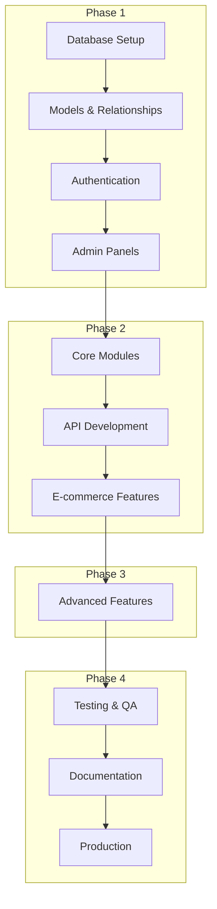

# Implementation Plan

## Overview

This plan outlines the development roadmap for Microweber CMS based on the defined scope. The project has already completed extensive testing, code quality improvements, and security hardening. This plan focuses on completing the remaining critical features, stabilizing the codebase, and preparing for production release.

**Current Status**: Phase 1 (Foundation) - 70% Complete
**Target**: MVP Release with 90+ modules tested and documented
**Timeline**: 8 weeks across 4 phases

---

## Phase 1: Foundation (Week 1-2) - IN PROGRESS

### Database & Models (80% Complete)
- [x] Core database migrations (users, content, products, orders, categories) (M) - Complete
- [x] User model with Spatie Permissions integration (M) - Complete
- [x] Content model with polymorphic relationships (M) - Complete
- [x] Product model with variants support (M) - Complete
- [x] Order model with payment tracking (M) - Complete
- [ ] feat: Create migration for media library metadata table (S) - Add JSON metadata column to media table
- [ ] feat: Add indexes for frequently queried columns (S) - Performance optimization for orders, products

### Authentication & Authorization (90% Complete)
- [x] Laravel Fortify integration (M) - Complete
- [x] Role-based access control via Spatie Permissions (M) - Complete
- [x] Admin authentication with Filament v5 (M) - Complete
- [ ] feat: Implement social login providers (Google, Facebook) (M) - OAuth configuration and UI

### Multi-Panel System (85% Complete)
- [x] Admin Panel with full access (M) - Complete
- [x] Billing Admin panel (M) - Complete
- [x] Newsletter Admin panel (M) - Complete
- [x] Customer Billing panel (M) - Complete
- [ ] feat: Customer Profile panel enhancements (S) - Order history, saved addresses

### Core Infrastructure (75% Complete)
- [x] Filament v5 admin interface (L) - Complete
- [x] Livewire v4 components (M) - Complete
- [x] Tailwind v4 styling (M) - Complete
- [x] Repository pattern implementation (M) - Complete
- [ ] feat: Redis caching configuration (S) - Production-ready caching setup
- [ ] feat: Queue workers configuration (S) - Background job processing

**Phase 1 Exit Criteria:**
- [ ] All database migrations pass
- [ ] Authentication flows working (email + social)
- [ ] Admin panels accessible with proper RBAC
- [ ] Core repository pattern implemented
- [ ] PHPStan level 5 passes
- [ ] Security scan passes

---

## Phase 2: Core Features (Week 3-4)

### E-commerce Module (60% Complete)
- [ ] feat: Complete checkout flow with multi-step wizard (L) - Guest checkout, shipping selection
- [ ] feat: Payment gateway integrations (Stripe, PayPal) (M) - Webhook handling, payment intents
- [ ] feat: Tax calculation engine (M) - Location-based tax rules
- [ ] feat: Shipping method management (M) - Flat rate, weight-based options
- [ ] feat: Invoice generation and email (M) - PDF generation, email templates
- [ ] test: E-commerce end-to-end tests (M) - Checkout flow, payment processing

### Content Management (70% Complete)
- [ ] feat: Visual drag-and-drop editor integration (L) - Livewire-powered editor components
- [ ] feat: Template system with live preview (M) - Template selector, customization
- [ ] feat: Multi-language content support (M) - Translation interface, locale switching
- [ ] feat: Media library enhancements (M) - Bulk upload, organization, CDN integration
- [ ] feat: SEO metadata management (S) - Meta tags, sitemap generation

### Module System (85% Complete)
- [x] Module auto-discovery (M) - Complete
- [x] Module migrations and assets (M) - Complete
- [ ] feat: Module marketplace integration (M) - Browse, install, update modules
- [ ] feat: Module dependency management (S) - Version constraints, conflict resolution
- [ ] feat: Module configuration UI (S) - Settings forms per module

### API Development (50% Complete)
- [ ] feat: RESTful API for content management (L) - CRUD endpoints for pages, posts
- [ ] feat: E-commerce API endpoints (M) - Products, cart, checkout API
- [ ] feat: API authentication with Sanctum (M) - Token management, scopes
- [ ] feat: API rate limiting (S) - Throttling configuration
- [ ] docs: OpenAPI/Swagger documentation (M) - API specs and examples

**Phase 2 Exit Criteria:**
- [ ] Complete checkout flow functional
- [ ] At least 3 payment gateways working
- [ ] Visual editor integrated
- [ ] RESTful API with authentication
- [ ] 90+ modules tested and documented

---

## Phase 3: Advanced Features (Week 5-6)

### AI & Automation (30% Complete)
- [ ] feat: AI Chat module completion (M) - Integration with OpenAI, conversation history
- [ ] feat: Content generation AI tools (M) - Auto-generate descriptions, SEO content
- [ ] feat: Automated email campaigns (M) - Triggered emails, abandoned cart recovery
- [ ] feat: Analytics dashboard widgets (S) - Traffic, sales, conversion metrics

### Marketing Features (40% Complete)
- [ ] feat: Newsletter campaign management (M) - Drag-and-drop email builder
- [ ] feat: Coupon/discount system completion (M) - Advanced rules, usage limits
- [ ] feat: Customer segmentation (M) - Tag-based segmentation, filters
- [ ] feat: Marketing automation workflows (L) - Visual workflow builder

### Advanced E-commerce (50% Complete)
- [ ] feat: Product variants and options (M) - Size, color, custom fields
- [ ] feat: Inventory management (M) - Stock tracking, low stock alerts
- [ ] feat: Advanced pricing rules (S) - Bulk pricing, customer-specific pricing
- [ ] feat: Multi-currency support (M) - Currency switching, exchange rates
- [ ] feat: Subscription billing (M) - Recurring payments, plan management

### System Enhancements (60% Complete)
- [ ] feat: Advanced caching strategies (M) - Full page cache, fragment caching
- [ ] feat: Backup and restore system (M) - Automated backups, one-click restore
- [ ] feat: Import/Export functionality (M) - CSV/Excel import for products, orders
- [ ] feat: Advanced user permissions (S) - Custom roles, resource-level permissions

**Phase 3 Exit Criteria:**
- [ ] AI Chat fully functional
- [ ] Newsletter campaigns working
- [ ] Product variants supported
- [ ] Backup system operational
- [ ] Import/Export features complete

---

## Phase 4: Polish & Production (Week 7-8)

### Testing & Quality Assurance (70% Complete)
- [ ] test: Achieve 80%+ code coverage (L) - Unit and integration tests
- [ ] test: Browser automation with Dusk (M) - Critical path user flows
- [ ] test: Load and performance testing (M) - Concurrent users, response times
- [ ] test: Security penetration testing (M) - Vulnerability assessment
- [ ] test: Cross-browser compatibility (S) - Chrome, Firefox, Safari, Edge

### Documentation (40% Complete)
- [ ] docs: API documentation (OpenAPI/Swagger) (M) - Complete endpoint documentation
- [ ] docs: User manual and guides (L) - End-user documentation
- [ ] docs: Developer documentation (L) - Module development, contribution guides
- [ ] docs: Deployment guides (M) - Server requirements, installation steps
- [ ] docs: Architecture decision records (S) - ADRs for key decisions

### Performance Optimization (50% Complete)
- [ ] perf: Database query optimization (M) - N+1 queries, missing indexes
- [ ] perf: Asset optimization (M) - Minification, CDN integration
- [ ] perf: Image optimization pipeline (S) - WebP conversion, lazy loading
- [ ] perf: Caching implementation (M) - Redis, application caching
- [ ] perf: Database query optimization (M) - Slow query analysis, indexing

### Security Hardening (80% Complete)
- [x] security: Implement automated security scanning (M) - Complete
- [x] security: SQL injection prevention (S) - Complete
- [x] security: XSS protection measures (S) - Complete
- [ ] security: CSRF token validation audit (S) - Verify all forms
- [ ] security: File upload validation (S) - MIME type, size limits
- [ ] security: Dependency vulnerability scanning (M) - Automated checks

### DevOps & Deployment (40% Complete)
- [ ] chore: Docker containerization (M) - Development and production images
- [ ] chore: CI/CD pipeline setup (M) - GitHub Actions, automated testing
- [ ] chore: Environment configuration (S) - Production-ready .env templates
- [ ] chore: Monitoring and logging (M) - Application logs, error tracking
- [ ] chore: SSL/TLS configuration guide (S) - HTTPS setup documentation

**Phase 4 Exit Criteria:**
- [ ] 80%+ test coverage achieved
- [ ] Documentation complete
- [ ] Performance benchmarks met
- [ ] Security audit passed
- [ ] Production deployment successful

---

## Dependencies

---

## Risk Assessment

| Risk | Probability | Impact | Mitigation |
|------|-------------|--------|------------|
| Filament v5 breaking changes | Medium | High | Comprehensive test suite, staged rollout |
| Module compatibility issues | High | Medium | Automated testing per module, compatibility layer |
| Payment gateway integration delays | Medium | High | Start with Stripe/PayPal first, add others later |
| Performance degradation | Low | High | Performance testing, caching strategy, profiling |
| Security vulnerabilities | Low | Critical | Automated security scans, code review process |
| Database migration failures | Medium | High | Backup strategy, rollback procedures, dry runs |
| API breaking changes | Low | Medium | Versioning strategy, backward compatibility tests |
| Third-party service outages | Medium | Low | Circuit breakers, fallback mechanisms |

---

## Success Metrics

### Technical Metrics
- **Test Coverage**: > 80% for core modules
- **PHPStan Level**: Level 5 with zero errors ✅
- **Security Audit**: Zero critical vulnerabilities
- **Performance**: Page load < 2s, API response < 500ms
- **Uptime Target**: 99.9% availability

### Business Metrics
- **Module Adoption**: 90+ modules maintained
- **API Stability**: No breaking changes in minor versions
- **Documentation**: Complete API docs and user guides
- **Community**: Active Discord and GitHub community

---

## Task Complexity Guide

- **S (Small)**: 1-2 hours, simple changes
- **M (Medium)**: 0.5-1 day, moderate complexity
- **L (Large)**: 2+ days, complex features requiring multiple components

---

## Current Progress Summary

**Completed Work (Pre-Planning):**
- ✅ Comprehensive test suite (178 UI tests, 273 feature tests)
- ✅ Code quality improvements (CartManager refactoring, TemplateManager cleanup)
- ✅ Security hardening (PHPStan, security scanning)
- ✅ UI/UX improvements (loading spinners, form validation, accessibility)
- ✅ Dependency management (semantic versioning)
- ✅ Repository pattern implementation
- ✅ Multi-panel Filament v5 integration

**Remaining Critical Work:**
- ⏳ Social login implementation
- ⏳ Checkout flow completion
- ⏳ Payment gateway integrations
- ⏳ Visual drag-and-drop editor
- ⏳ RESTful API completion
- ⏳ Module marketplace
- ⏳ AI Chat completion
- ⏳ Documentation
- ⏳ Production deployment

---

## References

- [SCOPE.md](SCOPE.md) - Product scope and requirements
- [TODO.md](TODO.md) - Current task list and completed work
- [SECURITY.md](SECURITY.md) - Security policy and scanning
- [CHANGELOG.md](CHANGELOG.md) - Version history

---

**Last Updated**: 2026-03-21
**Next Review**: Weekly on Mondays
