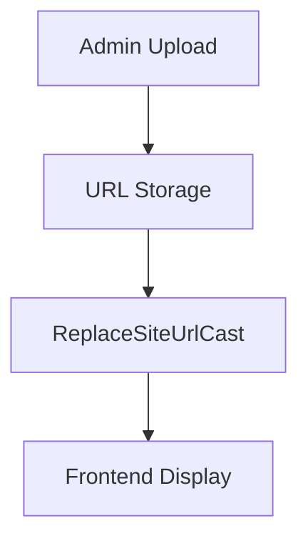

# Database Documentation

## User Thumbnail Storage System

### Architecture


### Key Characteristics
- **Storage Format**: 
  ```php
  'thumbnail' => ReplaceSiteUrlCast::class // Stores URLs with {SITE_URL} placeholder
  ```
- **Security Controls**:
  - Allowed extensions: jpg, png, gif
  - CSRF-protected updates
  - Auth-guarded endpoints
  - XSS prevention via StripTagsCast

### Workflow
1. Admin uploads image via Livewire component
2. System stores raw URL (e.g. `{SITE_URL}userfiles/thumbnails/avatar.jpg`)
3. `ReplaceSiteUrlCast` resolves to current domain on retrieval
4. Frontend displays with cache-busting timestamp

### Database Schema
```sql
CREATE TABLE users (
    id INT PRIMARY KEY,
    thumbnail VARCHAR(255) INDEX, -- Frequently queried field
    ...
    FOREIGN KEY (id) REFERENCES ...
);
```

### Constraints
- No local file storage
- External URLs blocked
- Max size determined by PHP config