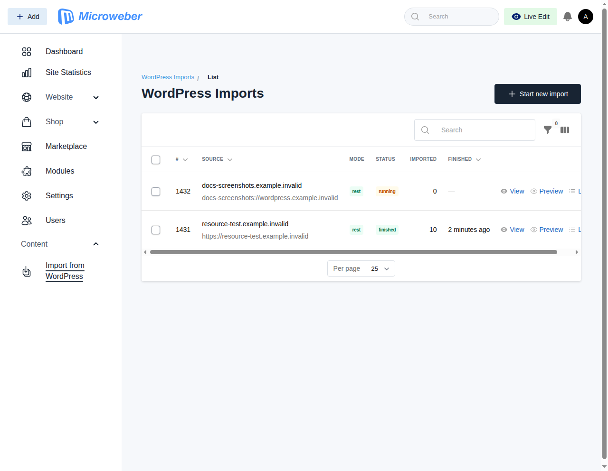
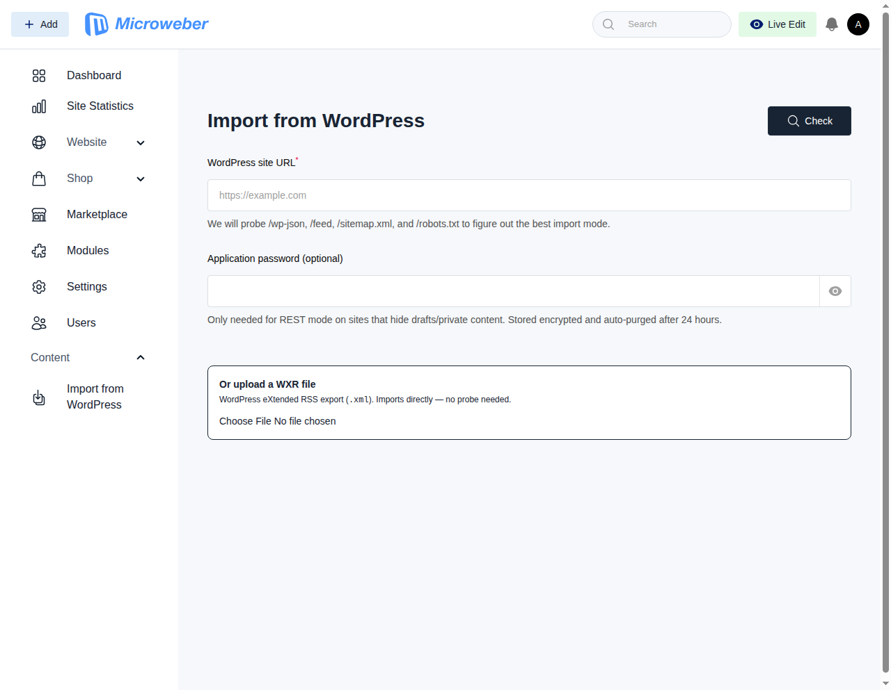
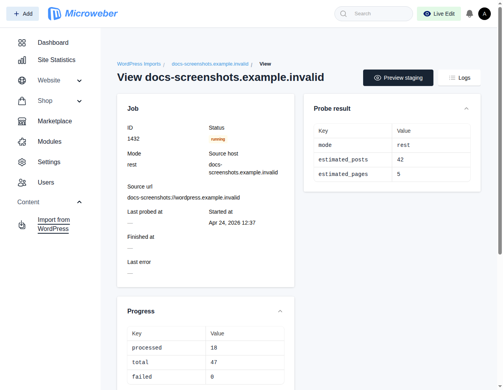
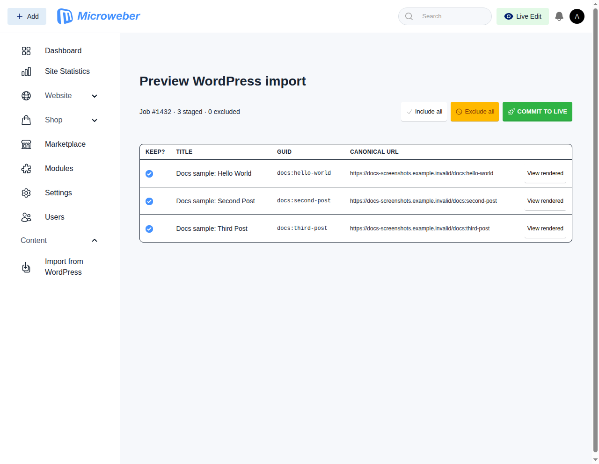
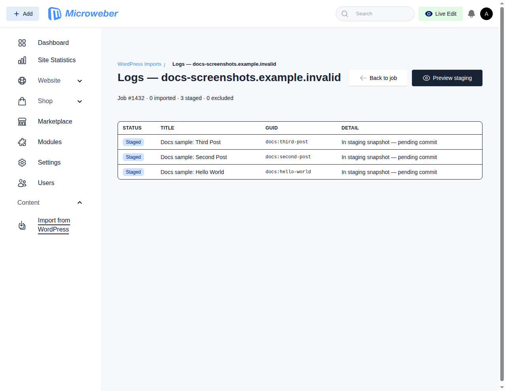

# WordPress migration — user walkthrough

> **Scope of this document:** Phase-11 user-facing walkthrough. Covers
> the four migration modes — REST, RSS, sitemap, WXR — from the admin
> UI's point of view, with screenshots from each step. The companion
> reference docs are `wordpress-scope.md` (what is and isn't in scope),
> `wordpress-mapping.md` (field-by-field mapping contract), and
> `../adr/wordpress-migration.md` (architecture decision record). The
> CLI reference for headless / CI use sits at the end of this file.

---

## 1. Before you start

Requirements:

- **Admin access** to the Microweber install you are importing into.
- **Read-only access** to a source WordPress site, *or* a WXR export
  file produced by **Tools → Export** in the source WordPress admin.
- For REST mode against private-content sites, a **WordPress
  application password** (created under **Users → Your Profile →
  Application Passwords** on the source). The password is stored
  encrypted and auto-purged after 24 hours — see `wordpress-scope.md`
  §4.

There's one sidebar entry for the whole flow: **Content → Import from
WordPress**.



The **WordPress Imports** list at `/admin/word-press-migration-resource`
is the historical scroll of every import that has ever run on this
install. Columns: source host, detected mode, live status, imported
count, last-finished time. Per-row actions let you jump into the
job's detail view, staging preview, or per-item logs.

Start a fresh import with the **+ Start new import** button in the
top right.

---

## 2. Picking a mode

All four modes produce the same per-item DTO and feed the same
downstream pipeline (stage → preview → commit), so the mode choice
is purely about how we *fetch* items from the source, not about what
lands on live content.

| Mode      | When to pick it                                                               | Needs network to the source? |
|-----------|-------------------------------------------------------------------------------|------------------------------|
| `rest`    | Modern WP (5.0+) with `/wp-json` reachable — richest payload (media ids, term slugs, accurate authors). **Preferred default.** | Yes |
| `rss`     | `/wp-json` is blocked by a security plugin but `/feed` still works. Loses media ids, preserves titles + body + guid. | Yes |
| `sitemap` | Neither REST nor RSS is reachable but the site exposes `/sitemap.xml`. Slowest path — we fetch each post's HTML page individually. | Yes |
| `wxr`     | Source site is offline, behind a login wall, or on `wordpress.com`. You have a **Tools → Export** XML file. | No — reads a local file |

When you paste a URL and click **Check**, the probe tests each
endpoint and picks the strongest capability automatically. You don't
normally need to override — the only time you'd force `--mode` is to
prove a fallback path works against a site that advertises more.

---

## 3. Mode 1 — REST (`/wp-json`)

### 3.1 Probe the source

From **Content → Import from WordPress**, hit **+ Start new import**.



1. Paste the source URL (e.g. `https://blog.example.com`).
2. *Optional*: paste an **application password** if the source hides
   drafts or private content behind authentication.
3. Click **Check**. The probe hits `/wp-json`,
   `/wp-json/wp/v2/posts?per_page=1`,
   `/wp-json/wp/v2/pages?per_page=1`, `/feed`, `/sitemap.xml`, and
   `/robots.txt`, then classifies the site.

A successful REST probe returns a "Probe complete" toast with the
advertised counts — e.g. `REST reachable · ~42 posts · ~5 pages`.

### 3.2 Start the import

Click **Start import**. The importer walks `/wp-json/wp/v2/posts` and
`/wp-json/wp/v2/pages` page-by-page, stopping when it sees a guid
that already lives in `content_data` (so re-running is safe — you
won't double-import).

### 3.3 Watch progress



Open the job from the imports list (**View** action). The detail
page carries:

- **Job** card — status badge, mode, source URL, started/finished
  timestamps.
- **Probe result** card — the raw capabilities + count payload the
  probe stored.
- **Progress** card — the importer's tick-by-tick counters
  (processed / imported / failed / total).

Below the infolist, a **Live progress** panel polls the DB every
3 seconds and shows the same counters as a dashboard with a progress
bar and ETA. Polling stops automatically when the job enters a
terminal status.

### 3.4 Preview before commit

REST, RSS, and sitemap imports all write to staging first — nothing
lands on live `content` until you say so.



Click **Preview staging** in the job's header actions. The preview
page shows every staged item with:

- **Keep?** — per-row toggle (check = will commit, unchecked =
  excluded).
- **Title / GUID / Canonical URL** — so you can spot-check what's
  about to land.
- **View rendered** — opens a sandboxed iframe with the rendered
  HTML so you can scan for broken shortcodes or leaked WordPress
  markup before committing.
- **Include all / Exclude all / Commit to live** — bulk actions in
  the header strip.
- **Retry failed ({n})** — appears only when a prior commit left
  rows flagged with `last_commit_error`. Scoped retry, not a full
  commit.

Click **Commit to live** and confirm. The committer runs staging
rows in chunks (default 50) inside DB transactions — a failing
chunk is rolled back cleanly, its rows keep their error message,
and later chunks still proceed.

### 3.5 Check logs



**Logs** in the job header opens a unified per-item view:

- **Imported** rows — successfully committed to live content.
- **Staged** rows — still in the staging snapshot, pending commit.
- **Excluded** rows — you unchecked them in preview; they stay as a
  receipt of what was dropped.

The header strip counts each category so you can eyeball the split
at a glance.

---

## 4. Mode 2 — RSS (`/feed`)

RSS is the fallback when `/wp-json` is blocked but `/feed` still
serves. The UI flow is identical to REST — same probe page, same
Start-import button, same preview → commit — but the probe classifies
the source as `rss` instead of `rest`.

Tradeoffs vs REST:

- RSS guids are stable (`http://site/?p=1001`), so idempotency still
  works.
- Term slugs are not available — categories and tags are resolved by
  **name** at commit time, which can produce new taxonomies on the
  Microweber side if the name doesn't match an existing one.
- Featured image resolution is best-effort (falls back to the first
  `` in the body if the feed doesn't advertise an enclosure).

Everything else — preview page, live progress polling, retry-failed
flow — behaves the same as REST.

---

## 5. Mode 3 — Sitemap

Sitemap mode is the last URL-based fallback. The probe reads
`/sitemap.xml` (or `/sitemap_index.xml`) to get a URL list, then the
importer fetches each URL individually and parses the HTML.

Same UI flow as REST/RSS — the probe picks `sitemap` only when
neither of the other two is reachable.

Tradeoffs vs RSS:

- Much slower — one HTTP round-trip per post.
- Guids are URL-based rather than `?p=<id>` based, which is still
  stable but not cross-referenceable with anything the source
  WordPress DB would call it.
- Works on sites that have completely disabled their feeds.

---

## 6. Mode 4 — WXR (offline `.xml` upload)

WXR is the only mode that does not require the source to be online.
Use it when:

- The source WordPress site is **offline**, gone, or replaced.
- The source is on **wordpress.com** (which uses a different API
  surface and blocks most probes).
- Auth is required and issuing an application password is
  impractical (enterprise SSO, archived installs).

On the source site, go to **Tools → Export**, pick **All content**,
and download the `.xml` file. Then on this Microweber install:

1. Open **Content → Import from WordPress**.
2. Click **+ Start new import** — the same page as the URL probe.
3. Instead of pasting a URL, use **Or upload a WXR file** near the
   bottom of the form (see the second screenshot above).
4. Choose the `.xml` file and click **Import WXR**. The importer
   parses the file in-process and stages every supported item.

From here the flow is identical to the URL-based modes: open the
preview, exclude anything you don't want, commit to live, check
logs.

---

## 7. Handling failures

### 7.1 Commit chunk failures

When a batch of staging rows fails to commit (taxonomy resolution,
media rehosting, whatever), the batch is rolled back, the staging
rows get `last_commit_error` set to the exception message, and the
commit proceeds to the next chunk. You'll see a red "N failed"
counter in the preview page's header strip.

Fix the root cause (e.g. add the missing taxonomy manually, or
unblock the origin for media rehosting), then click **Retry failed
({n})** in the preview page or run the equivalent CLI:

```bash
php artisan microweber:import:wordpress:commit <job-id> \
  --retry-failed --yes
```

### 7.2 Partial imports and resumability

Every importer walks guid-by-guid and short-circuits as soon as it
sees a guid that's already on `content_data`. Re-running the import
against the same source is idempotent — you can safely start, stop,
and resume without creating duplicates.

### 7.3 Credential expiry

Application passwords are stored encrypted and auto-purged after 24
hours. If an import runs into a 401 because the credential expired
mid-run, the job's status flips to `failed` with the 401 message as
`last_error`; re-probe with a fresh application password and the
pipeline picks up from where it stopped.

---

## 8. CLI & headless flows

Everything the admin UI does is also available as artisan commands.
Same importers, same staging tables, same committer — the CLI is a
thin orchestration layer, not a parallel implementation.

### 8.1 Quick start

```bash
# Preview an import without writing to live content.
php artisan microweber:import:wordpress https://example.com --dry-run --yes

# Commit the staged rows onto live content.
# (Replace 42 with the job id printed by the previous command.)
php artisan microweber:import:wordpress:commit 42 --yes

# Check a job's status at any point.
php artisan microweber:import:wordpress:status 42

# Import from a WordPress WXR export file.
php artisan microweber:import:wordpress /path/to/export.xml \
  --mode=wxr --yes
```

### 8.2 `microweber:import:wordpress`

The headless driver. Probes a URL or parses a WXR file, walks the
importer, and either writes to live content or stages for preview.

```
microweber:import:wordpress <url>
  [--mode=rest|rss|sitemap|wxr]
  [--dry-run]
  [--yes]
  [--max=100]
```

| Flag        | Default | Meaning                                                               |
|-------------|---------|-----------------------------------------------------------------------|
| `url`       | —       | WordPress site URL; or a local `.xml` path when `--mode=wxr`          |
| `--mode`    | auto    | Force a specific importer. When omitted, probe picks the strongest (`rest > rss > sitemap`) |
| `--dry-run` | off     | Write to `wp_migration_staging_*` instead of live `content`           |
| `--yes`     | off     | Auto-accept the confirmation prompt (required for CI)                 |
| `--max`     | 100     | Cap on items walked this run; must be a positive integer              |

**Exit codes**

| Code | Meaning                                                   |
|------|-----------------------------------------------------------|
| 0    | Success (items staged or committed)                       |
| 1    | Unreachable source / no usable importer                   |
| 2    | Validation error (bad URL, unknown mode, missing file)    |
| 3    | Importer raised mid-run                                   |

### 8.3 `microweber:import:wordpress:status`

Inspect a job. Useful as a "done yet?" poll from a CI script.

```
microweber:import:wordpress:status <job-id> [--json]
```

- Human output (default) prints status, mode, URL, progress counters,
  and staging counts in a labelled block.
- `--json` emits a machine-readable payload. Keys are stable:
  `job_id`, `status`, `mode`, `source_url`, `source_host`,
  `started_at`, `finished_at`, `progress.{processed, imported,
  failed, total, stop_reason}`, `staging.{staged, excluded,
  last_commit_error_rows}`, `last_error`.

**Exit codes**

| Code | Meaning                                        |
|------|------------------------------------------------|
| 0    | Job found (status itself is the signal)        |
| 2    | Validation error                               |
| 4    | Job not found                                  |

### 8.4 `microweber:import:wordpress:commit`

Promotes staging rows for a job onto live content. Same code path as
the Filament preview page's **Commit to live** button.

```
microweber:import:wordpress:commit <job-id>
  [--yes]
  [--retry-failed]
```

- Runs staging rows in chunks inside DB transactions. A chunk that
  throws is fully rolled back; its rows are flagged with
  `last_commit_error` and the command continues to the next chunk.
- `--retry-failed` narrows the commit to rows carrying a prior
  `last_commit_error`. Use this after fixing a root cause.

**Exit codes**

| Code | Meaning                                     |
|------|---------------------------------------------|
| 0    | Commit finished with zero failures          |
| 2    | Validation error                            |
| 4    | Job not found                               |
| 5    | Commit finished with ≥ 1 failed row         |

### 8.5 End-to-end CLI example

Goal: a staged import on Friday, an operator eyeball on Saturday via
the admin UI, and a scripted commit on Sunday once sign-off lands.

```bash
# Friday — stage up to 500 items. No live content is written.
php artisan microweber:import:wordpress https://blog.example.com \
  --mode=rest --dry-run --yes --max=500

# Pluck the job id.
JOB_ID=$(php artisan microweber:import:wordpress:status \
  "$(mysql -Ne 'select max(id) from wp_migration_jobs;')" --json \
  | jq -r '.job_id')

# Saturday — operator opens "Content → Import from WordPress",
# unchecks 4 draft-looking rows in the preview page. No CLI involved.

# Sunday — commit to live.
php artisan microweber:import:wordpress:commit "$JOB_ID" --yes
```

A clean commit prints:

```
Commit complete: 496 committed, 4 skipped (excluded), 0 failed.
```

If anything failed, fix the root cause and retry only the affected
rows:

```bash
php artisan microweber:import:wordpress:commit "$JOB_ID" \
  --retry-failed --yes
```

### 8.6 CI pipelines

A typical smoke check — already wired into this repo's
`wordpress-import-smoke.yml` workflow:

```yaml
- name: Smoke-test WordPress importer
  run: |
    php -S 127.0.0.1:9876 -t tests/fixtures/wp \
      tests/fixtures/wp/router.php &
    sleep 2
    php artisan microweber:import:wordpress \
      http://127.0.0.1:9876 \
      --mode=rss --dry-run --yes --max=10
```

For scripted cutovers, the `status --json` payload is the stable
gate:

```bash
JOB_ID=42

# Wait for the staging job to finish.
while true; do
  STATUS=$(php artisan microweber:import:wordpress:status \
    "$JOB_ID" --json | jq -r '.status')
  case "$STATUS" in
    finished)   break ;;
    failed|unreachable|canceled)
      echo "Reached terminal state: $STATUS" >&2; exit 1 ;;
    *) sleep 10 ;;
  esac
done

# Commit. Exit 5 = some rows failed.
php artisan microweber:import:wordpress:commit "$JOB_ID" --yes \
  || exit $?
```

---

## 9. Refreshing the screenshots

The PNGs in `docs/migration/screenshots/` are captured by a Dusk
test in the `docs` group — running it against a dev server + the
repo's WordPress fixture regenerates the whole set from scratch.

```bash
# Terminal 1
php artisan serve --host=127.0.0.1 --port=8000

# Terminal 2 — WordPress fixture on a stable high port
php -S 127.0.0.1:18877 -t tests/fixtures/wp tests/fixtures/wp/router.php

# Terminal 3
php artisan dusk --group=docs
```

The capture test lives at
`tests/Browser/DocsWordPressImportScreenshotsTest.php` and is
tagged `@group docs` so it does **not** run in the default
`composer test:browser` pass — screenshot capture is a documentation
concern, not a regression test.

---

## 10. Where things live

| Surface                              | File                                                                                       |
|--------------------------------------|--------------------------------------------------------------------------------------------|
| Driver command                       | `Modules/WordPressMigration/Console/Commands/ImportWordPressCommand.php`                   |
| Status command                       | `Modules/WordPressMigration/Console/Commands/ImportWordPressStatusCommand.php`             |
| Commit command                       | `Modules/WordPressMigration/Console/Commands/ImportWordPressCommitCommand.php`             |
| Filament admin resource              | `Modules/WordPressMigration/Filament/Resources/WordPressMigrationResource.php`             |
| URL probe page                       | `Modules/WordPressMigration/Filament/Pages/WordPressMigrationImportPage.php`               |
| Preview page                         | `Modules/WordPressMigration/Filament/Pages/WordPressMigrationPreviewPage.php`              |
| Probe → capabilities                 | `Modules/WordPressMigration/Services/WordPressSiteProbe.php`                               |
| REST / RSS / sitemap / WXR importers | `Modules/WordPressMigration/Services/Importers/`                                           |
| Staging writer (dry-run)             | `Modules/WordPressMigration/Services/StagingWriter.php`                                    |
| Live mapper                          | `Modules/WordPressMigration/Services/WordPressContentMapper.php`                           |
| Committer (promote staging → live)   | `Modules/WordPressMigration/Services/StagingCommitter.php`                                 |

The CLI and the admin UI are both thin orchestration layers over
these services — every invariant (idempotency, transactional commit,
whole-batch rollback, persisted-error retry scope) is enforced by
the same code regardless of which surface drives it.
