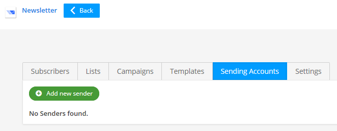
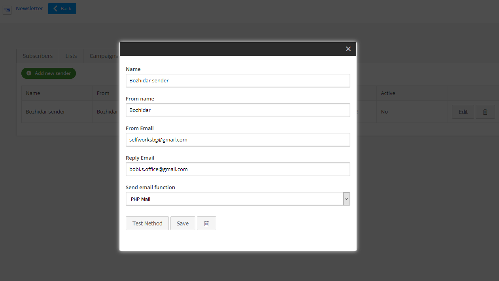
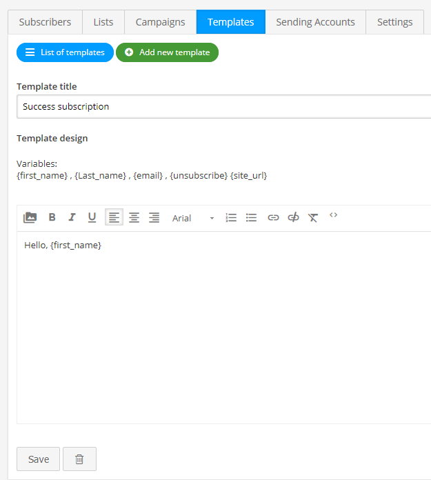
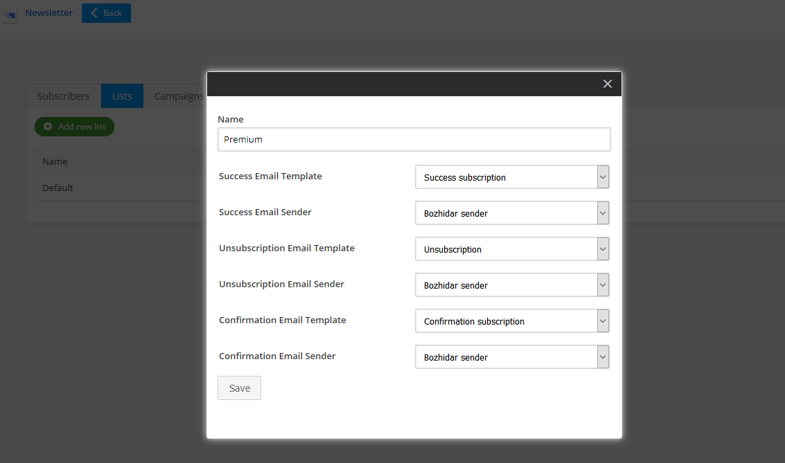
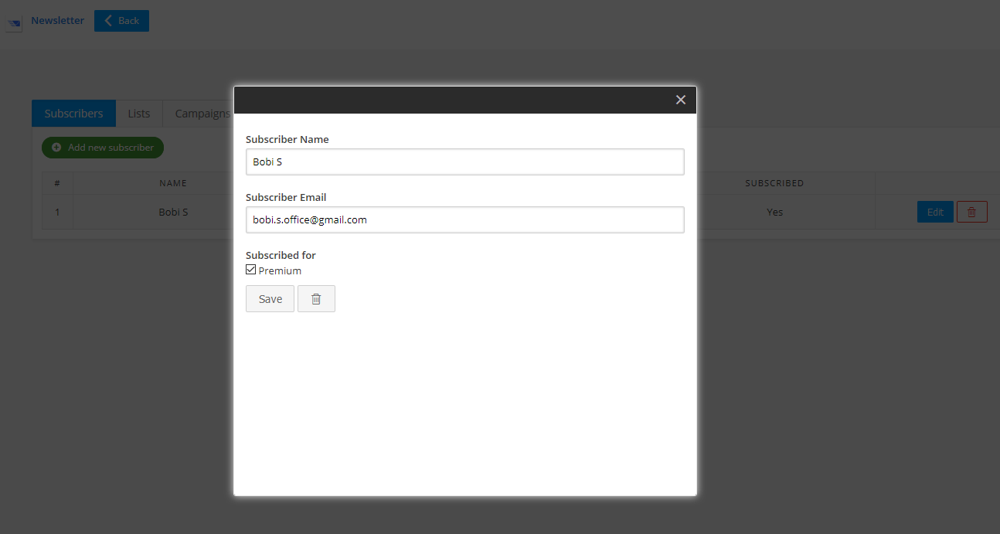
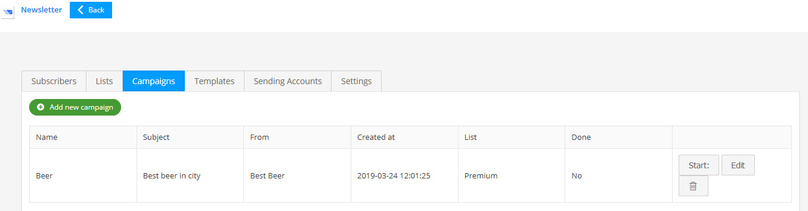
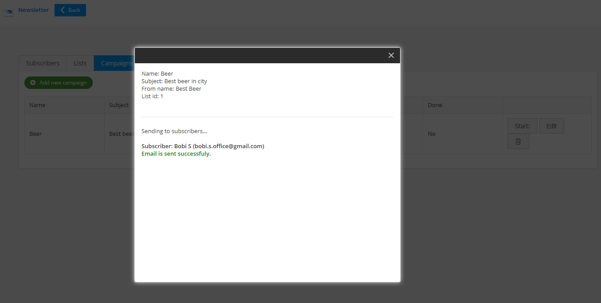

# Microweber: Newsletter Module [User Guide]

#### How to use?
#### You can easy start using newsletter module with five simple steps:

#### 1. Create Sending Account

Fill your sender details, select your email function method and test it.

### 2. Create Email Template

Create another email template types. (Recommended) 

### 3. Create Subscriber List

Set name of list, select email sender and current templates.

### 4. Create Campaign

Fill campaign details, select list and email sender

### 5. Create Test Subscriber

Fill the tester details and select the subscribed list.

### 5. Start Your First Campaign!

