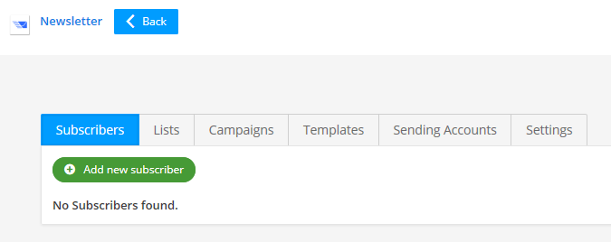

# Microweber: Newsletter Module [User Guide]

#### How to use?
You can easy start working with newsletter module with this simple steps:

#### 1. Create new Sending Account

Select your email function method and test it.

### 2. Create new Email Template

Create another email template types. (Recommended) 

