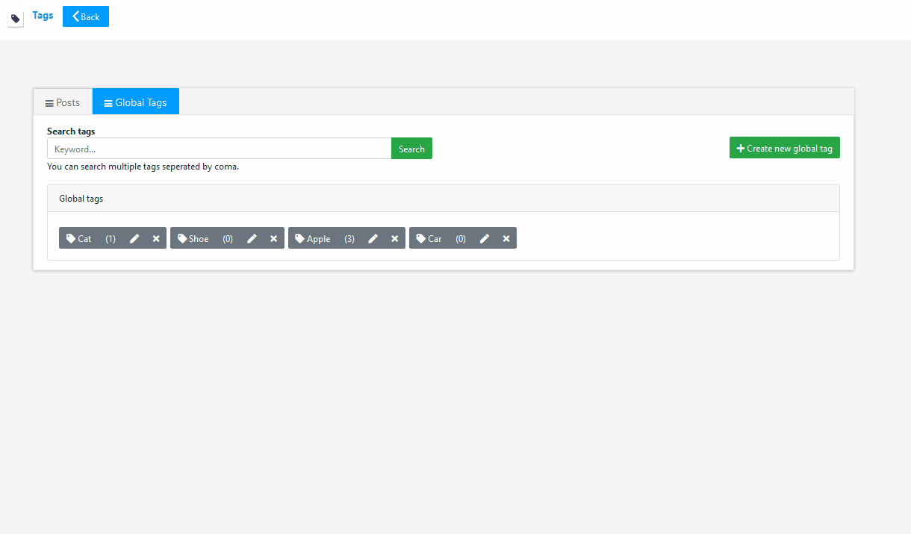
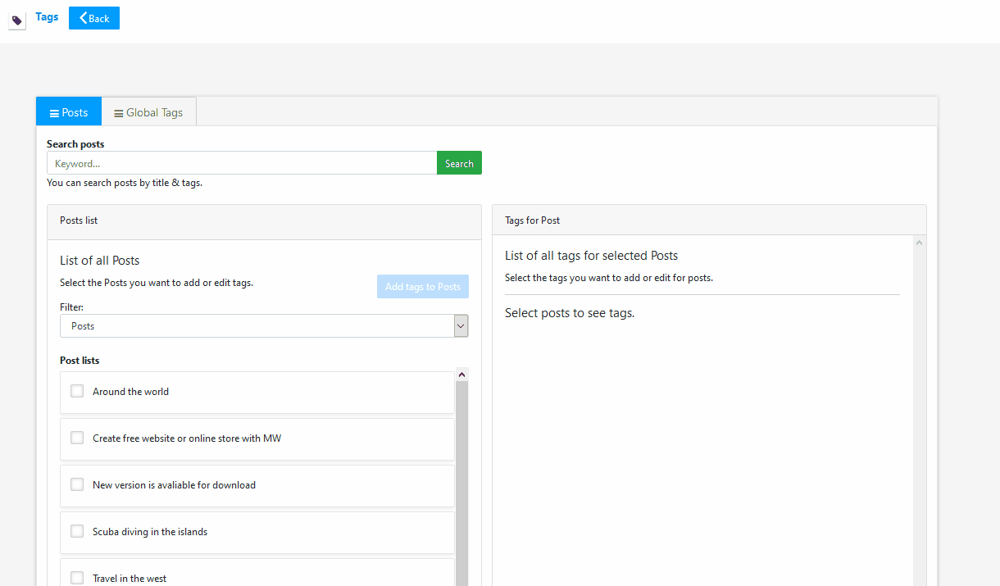
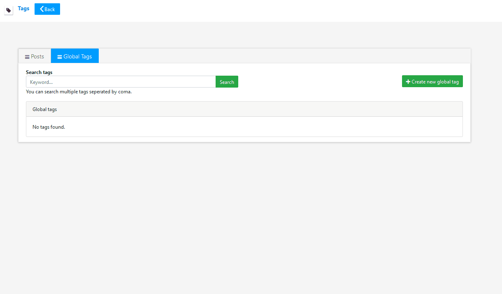

# Microweber Tag Module
The microweber tag module allows you to quickly and easily to add tag blog posts and products.
You can add custom slug and descriptions to every tag & see how count of posts use this tag.

# Features
 - Advanced gobal tag serching
 - Quick Add Global Tag
 - Quick Edit Global Tag
 - View Posts of Global Tag
 - View Count of Posts to tag
 - Advanced posts/products tag serching
 
# How to use Tags Module?

