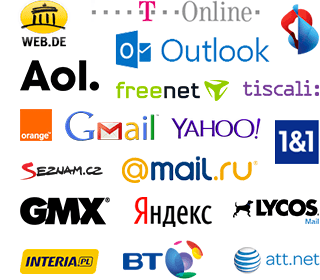

Webmail Linker
===========================================================================================

Collection of Email Providers' Webmail Sites
-------------------------------------------------------------------------------------------


### About                   



Many websites require an email double opt-in during user registration. This project wants
to fix the resulting break in user flow when users have to manually switch to their email
providers' website to receive the confirmation email.

With Webmail Linker, you can offer a direct link to the user's webmail interface. In
addition to the webmail URL, you'll get the name of the email provider and a favicon URL,
so you can offer a button like "Check your email on [name and icon of the provider]".

**The list contains 200+ email providers so far.**


### Languages

The core of this project, the list of email providers, is maintained in JSON. The provided
wrapper classes to query the list are very simple – feel free to add libraries for other
languages via pull requests.

Usage example (PHP):

```php
$wl = new WebmailLinker();

if($provider = $wl->getProviderByEmailAddress('user@example.com')) {
  $html = '<a href="%s">Check your email at %s</a>';
  printf($html, htmlspecialchars($provider['url']), htmlspecialchars($provider['name']));
}
```


### Contributing

Let's make Webmail Linker the most comprehensive compilation of email providers out there!

You can fork this repository and create pull requests for `providers.json`. You do not
even have to check out the repository – GitHub's web editing capabilities make contributing
even simpler.